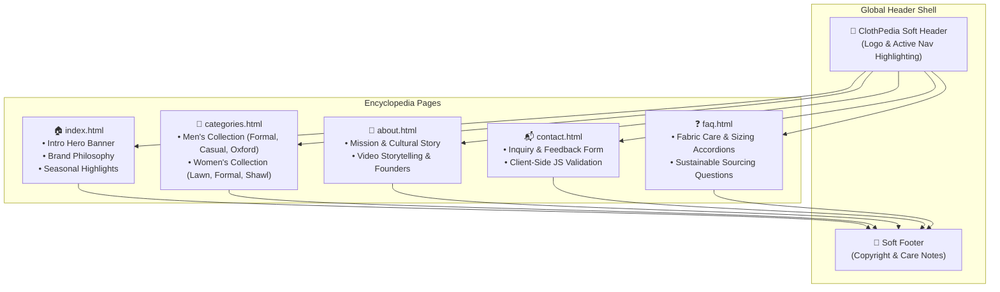

# 👘 ClothPedia — A Calm Fashion Encyclopedia

[](https://github.com/shayann07/ClothPedia)
[](https://developer.mozilla.org/en-US/docs/Web/HTML)
[](https://developer.mozilla.org/en-US/docs/Web/CSS)
[](https://developer.mozilla.org/en-US/docs/Web/JavaScript)
[](LICENSE)

> An interactive fashion and clothing encyclopedia web portal designed around calm aesthetics, seasonal curations, cultural fabric narratives, and responsive multi-page navigation.

---

## 📖 Overview

**ClothPedia** is a visual and educational fashion encyclopedia designed to explore clothing, culture, fabric craftsmanship, and seasonal style. Built with modern semantic **HTML5**, modular **CSS3**, and lightweight **Vanilla JavaScript**, the portal emphasizes peaceful, minimalist design and informative curation over fast-fashion commercial noise.

### Visual & Architectural Concept
- **Calm Aesthetic Design**: Soft pastel earth tones, airy whitespace, and tranquil typography using Google Fonts (**Roboto**).
- **Curated Cultural Collections**: Dedicated sections highlighting both traditional ensembles (Summer Lawn, Winter Shawls) and contemporary apparel (Oxfords, Casuals, Formals).
- **Multi-Media Richness**: Integrated video storytelling (`VideoAbout.mp4`) and high-resolution lifestyle photography with lazy-loading attributes (`loading="lazy"`).
- **Client-Side Form Validation**: Real-time JavaScript input handling and validation for user inquiries and feedback.

---

## 🏗️ Portal Architecture & User Flow



---

## ✨ Features & Interactive Capabilities

- **Curated Category Gallery**:
  - **Men’s Collection**: Formal Suiting, Casual Everyday Staples, and Classic Oxford wear.
  - **Women’s Collection**: Breathable Summer Lawn Suits, Elegant Formal Dresses, Everyday Casuals, and Traditional Winter Shawl Ensembles.
- **Client-Side Validation Engine**: Embedded JavaScript listener on `contactForm` verifying name, email formatting, topic selection, and non-empty message payloads before submission.
- **Interactive FAQ Accordions**: Structured answers covering garment sizing, organic fabric preservation, seasonal care guides, and global shipping policies.
- **Responsive Soft Layouts**: Adaptive flexbox and grid layouts configured in `styles.css` with smooth image scale transitions on card hover.

---

## 📱 Key Pages & Asset Breakdown

| Page / Asset | Location | Content & Interactive Elements |
|---|---|---|
| **Home Page** | [`index.html`](file:///d:/Work/github_full_account/ClothPedia/index.html) | Brand story, serene mood hero, and quick category entry points |
| **Categories Portal** | [`categories.html`](file:///d:/Work/github_full_account/ClothPedia/categories.html) | Multi-grid showcase categorized by gender, season, and occasion |
| **About Page** | [`about.html`](file:///d:/Work/github_full_account/ClothPedia/about.html) | Philosophical narrative, founder background, and vision statements |
| **Contact Page** | [`contact.html`](file:///d:/Work/github_full_account/ClothPedia/contact.html) | Interactive support form with dynamic validation alerts |
| **FAQ Page** | [`faq.html`](file:///d:/Work/github_full_account/ClothPedia/faq.html) | Comprehensive Q&A repository for fabric care, materials, and support |
| **Stylesheet** | [`styles.css`](file:///d:/Work/github_full_account/ClothPedia/styles.css) | Custom CSS variables, responsive grid breakpoints, card hover effects |
| **Media Assets** | [`assets/`](file:///d:/Work/github_full_account/ClothPedia/assets) | Curated collection imagery and local MP4 background video |

---

## 🛠️ Technical Stack Matrix

| Layer | Technology | Usage & Specification |
|---|---|---|
| **Markup** | HTML5 | Semantic elements, accessible ARIA attributes, lazy-loaded images |
| **Styling** | CSS3 | Custom soft palettes, flexbox/grid containers, micro-transitions |
| **Scripting** | Vanilla JS (ES6+) | Form validation, event listeners, dynamic submission handling |
| **Typography** | Google Fonts | Roboto typeface (weights 400 and 700) |
| **Media Format** | WebP / JPEG / MP4 | Optimized visual assets and media clips |

---

## 🚀 Getting Started

### Prerequisites
- Any modern web browser (Chrome, Edge, Safari, Firefox).
- Optional: Local web server (Python `http.server` or Node.js `serve`).

### Local Development

1. **Clone the Repository**:
   ```bash
   git clone https://github.com/shayann07/ClothPedia.git
   cd ClothPedia
   ```

2. **Launch with Local HTTP Server**:
   ```bash
   # Using Python 3
   python -m http.server 3000

   # Or using Node.js
   npx serve .
   ```

3. **Open in Browser**:
   Visit `http://localhost:3000` to browse the encyclopedia.

---

## 📄 License

This project is licensed under the [MIT License](LICENSE) — Copyright (c) 2026 [shayann07](https://github.com/shayann07).
